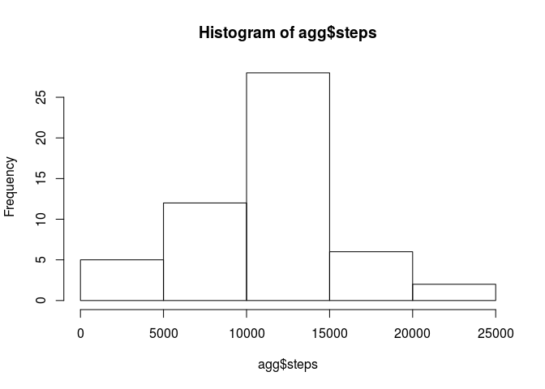
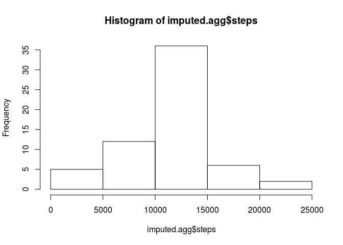
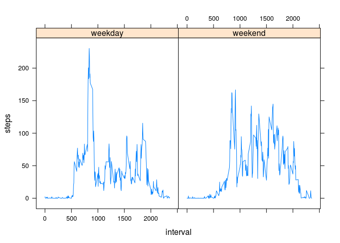

# Reproducible Research: Peer Assessment 1


## Loading and preprocessing the data
Unzip and read in the csv file.

```r
df <- read.csv(unz("activity.zip", "activity.csv"))
```
transform(df, date = as.Date(date))

## What is mean total number of steps taken per day?

Find the total number of steps taken each day:

```r
agg <- aggregate(steps ~ date, data = df, sum)
```

Construct a histogram of the total number of steps taken each day:

```r
hist(agg$steps)
```

 

We can now calculate the mean total number of steps taken per day:

```r
mean(agg$steps)
```

```
## [1] 10766.19
```

and the median total number of steps taken per day:

```r
median(agg$steps)
```

```
## [1] 10765
```


## What is the average daily activity pattern?
First average the number of steps taken for each interval across all days:

```r
df.interval <- aggregate(steps ~ interval, data = df, mean)
```

Next create a time-series plot for the average activty levels (number of steps) for 5-minute intervals:

```r
plot(df.interval, type="l")
```

 

Finally we can find the 5-minute interval assocaiated with the maximum average number of steps:

```r
df.interval[df.interval$steps == max(df.interval$steps),]
```

```
##     interval    steps
## 104      835 206.1698
```

## Imputing missing values
There are days/intervals that are missing values. The total number of missing values in the dataset is:

```r
sum(is.na(df$steps))
```

```
## [1] 2304
```

Using the na.aggregate function in the zoo package, it is straightforward to impute missing values with their grouped averages. Here we replace missing values with the average number of steps of its associated interval. We create a new dataset using these imputed values

```r
library(zoo)
filled <- na.aggregate(df$steps, by=df$interval)
imputed <- df
imputed$steps = filled
```


Compute the total number of steps taken each day:

```r
imputed.agg <- aggregate(steps ~ date, data = imputed, sum)
```

Examine a histogram of the total number of steps taken each day *after* missing values have been imputed:

```r
hist(imputed.agg$steps)
```

 

Use these totals from the imputed dataset to recompute the mean and median total number of steps taken per day.  

Calculate the mean total number of steps taken per day:

```r
mean(imputed.agg$steps)
```

```
## [1] 10766.19
```

Calculate the median total number of steps taken per day:

```r
median(imputed.agg$steps)
```

```
## [1] 10766.19
```

The mean and median total number of steps taken per day for the original dataset were 1.0766189\times 10^{4} and 10765, respectively. The mean is unchanged and the median has shifted to now equal the mean. These measures of central tendency for both the original and imputed datasets are very similar and the impact of imputation is likely negligible.

## Are there differences in activity patterns between weekdays and weekends?

We can use the timeDate library to easily test whether a particular date is a weekday or weekend using the isWeekday function. This creates a logical vector, which we can then transform into a new factor variable.

```r
library(timeDate)
imputed$week = factor(isWeekday(imputed$date), levels=c(TRUE, FALSE), labels=c('weekday', 'weekend'))
```

Next we consider two groups of observations (weekday/weekend) and calculate the mean number of steps for each interval, averaged across all days in their respective groups.

```r
imputed.agg.week <- aggregate(steps ~ interval + week, data = imputed, mean)
```

Finally, using lattice plots, we can construct a multi-panel timeseries plot comparing activity patterns between weekdays and weekends.

```r
library(lattice)
xyplot(steps ~ interval | week, data=imputed.agg.week, type="l")
```

 
